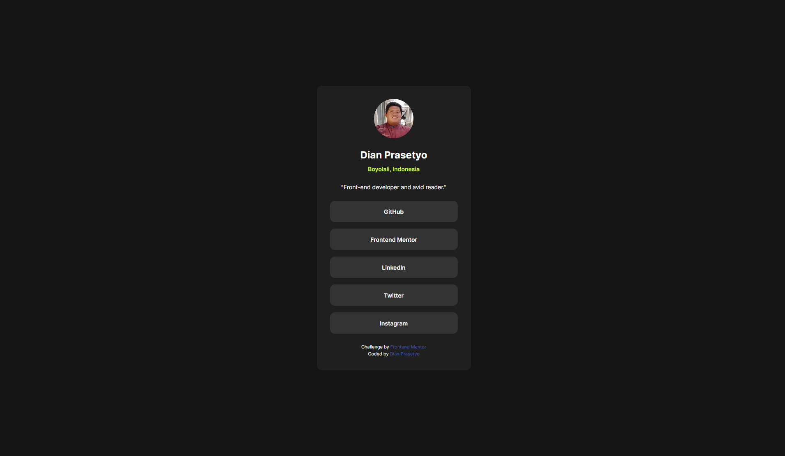

# Frontend Mentor - Social links profile solution

This is a solution to the [Social links profile challenge on Frontend Mentor](https://www.frontendmentor.io/challenges/social-links-profile-UG32l9m6dQ). Frontend Mentor challenges help you improve your coding skills by building realistic projects.

## Table of contents

- [Overview](#overview)
  - [The challenge](#the-challenge)
  - [Screenshot](#screenshot)
  - [Links](#links)
- [My process](#my-process)
  - [Built with](#built-with)
  - [Useful resources](#useful-resources)
- [Author](#author)

## Overview

### The challenge

In this challenge, I build a responsive web application. Is is a social link profile where people can see my social medias and visit the site.

Users should be able to:

- See list of social media links
- See hover and focus states for all interactive elements on the page
- Go to soclial media page which they click

### Screenshot

Thisis the result of the challenge

- Mobile Preview

- Desktop Preview

### Links

- Solution URL: [Github Repository](https://github.com/frontendbydian/social-link-profile)
- Live Site URL: [Dian's Social Link](https://linkdianprasetyo.netlify.app/)

## My process

### Built with

- Semantic HTML5 markup
- Flexbox
- CSS Grid
- Mobile-first workflow
- [React](https://reactjs.org/) - JS library
- [Next.js](https://nextjs.org/) - React framework
- [Tailwind CSS](https://tailwindcss.com)

### Useful resources

- [Tailwind CSS Documentation](https://tailwindcss.com/docs/installation) - This helped me to build the site using tailwind css. There are many css property and sometimes I forgot the property name and how to use it. This documentation helped me to find what I need.

## Author

- Website - [Dian Prasetyo](https://dianprasetyo.vercel.app/)
- Frontend Mentor - [@dianprsty](https://www.frontendmentor.io/profile/dianprsty)
- Twitter - [@dianprsty](https://x.com/dianprsty)
